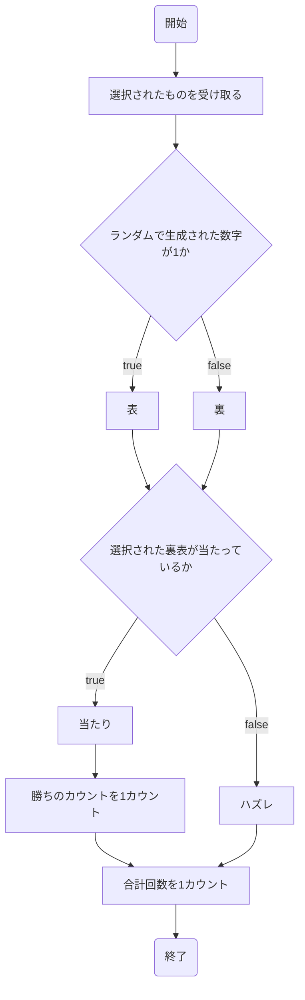
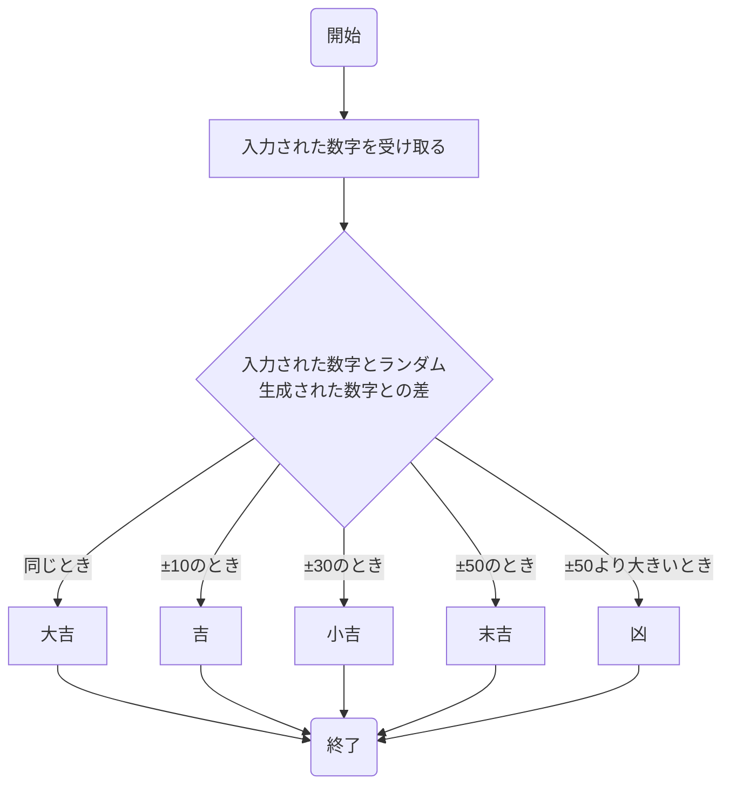
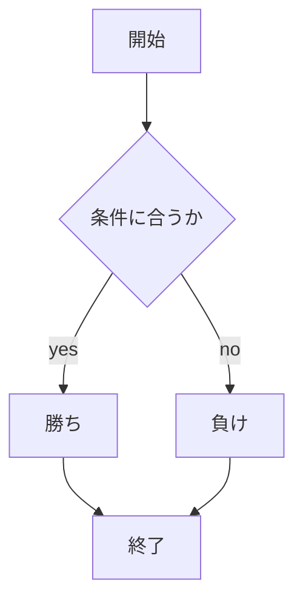

# webpro_06
10月29日

## 起動方法
プログラムを使用するに当たってプログラムの書かれたサーバーを起動する必要がある．起動する方法は下記のとおりである．
1. ターミナルを起動しプログラムの入った適切なファイルに移動する．
1. ターミナルで```node app5.js```を入力しプログラムのサーバーを起動する．


## 編集したファイルをgitで管理する方法
gitとは複数あるバージョン管理システムの1つである．バージョン管理システムでは，変更履歴を記憶し必要に応じて遡れるため，変更した場所がわかりやすく，また過去の状態に戻すことができる．
編集したファイルを実行するには以下の手順でアップロードする．
1. ターミナルを起動し適切なファイルに移動する．
1. ターミナルで```git add .```を入力し実行する．
1. ```git commit -am'コメント'```コメントの部分は修正・追加した内容を入力し実行する．
1. ```git push```を入力しアップロードする．
1. パスワードを要求されたときはアクセストークンを入力する．

## コイントスをするプログラム
### このプログラムの概要
このプログラムでは，コイントスをしたときの裏表を予想して選択し，選択した裏表が当たっているかを表示するプログラムである．
このプログラムの処理の流れは下記のフローチャートの通りである．


### このプログラムの使用方法
1. サーバーを起動する．
1. Webブラウザでlocalhost:8080/public/cointoss.htmlにアクセスする
1. 表と裏の選択肢から1つを選び送信する


## 占いをするプログラム
### このプログラムの概要
このプログラムでは，1から100の好きな数字を入力し，ランダムに選ばれた数字との差によって大吉，吉，小吉，末吉，凶の5つの運勢から占うプログラムである．
このプログラムの処理の流れは下記のフローチャートの通りである．


### このプログラムの使用方法
1. サーバーを起動する．
1. Webブラウザでlocalhost:8080/public/uranai.htmlにアクセスする．
1. 入力をする欄に1から100の数字を入力し送信する．


## じゃんけんをするプログラム
### このプログラムについて

### プログラムの使用方法
1. ```node app5.js ```でプログラムを起動する
1. Webブラウザでlocalhost:8080/public/janken.htmlにアクセスする
1. 自分の手を入力する

## ファイルの一覧
ファイル名 | 説明
-|-
app5.js | プログラム本体
public/janken.html | じゃんけんの開始画面
views/janken.ejs | じゃんけんのテンプレートファイル
public/cointoss.html | コイントスの開始画面
views/cointoss.ejs | コイントスのテンプレートファイル
public/uranai.html | 占いの開始画面
views/uranai.ejs | 占いのテンプレートファイル

