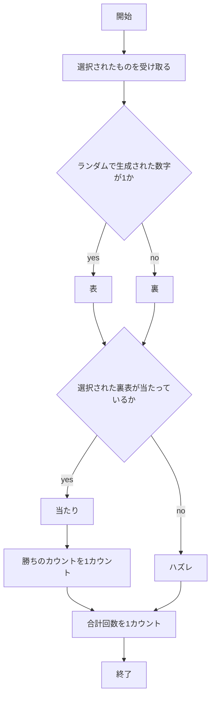
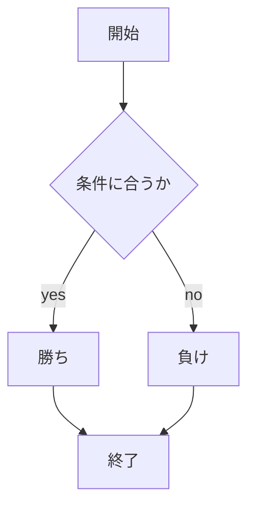

# webpro_06
10月29日


## コイントスをするプログラム
### このプログラムの概要
このプログラムでは，コイントスをしたときの裏表を予想して選択し，選択した裏表が当たっているかを表示するプログラムである．
このプログラムの処理の流れは下記のフローチャートの通りである．


### このプログラムの使用方法
1. ターミナルで```node app5.js ```を打ちプログラムを起動する
1. Webブラウザでlocalhost:8080/public/cointoss.htmlにアクセスする
1. 表と裏の選択肢から1つを選び送信する


##　じゃんけんをするプログラム
### このプログラムについて

### プログラムの使用方法
1. ```node app5.js ```でプログラムを起動する
1. Webブラウザでlocalhost:8080/public/janken.htmlにアクセスする
1. 自分の手を入力する

## ファイルの一覧
ファイル名 | 説明
-|-
app5.js | プログラム本体
public/janken.html | じゃんけんの開始画面
views/janken.ejs | じゃんけんのテンプレートファイル
public/cointoss.html | コイントスの開始画面
views/cointoss.ejs | コイントスのテンプレートファイル

